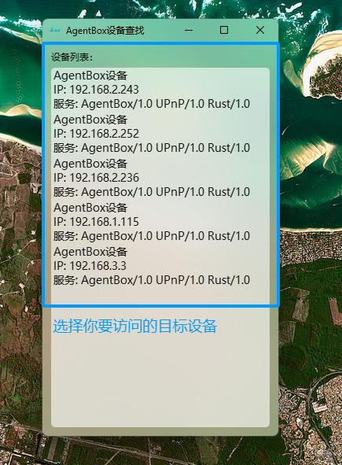
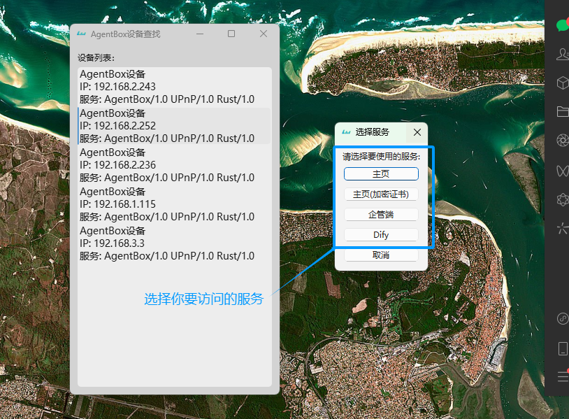
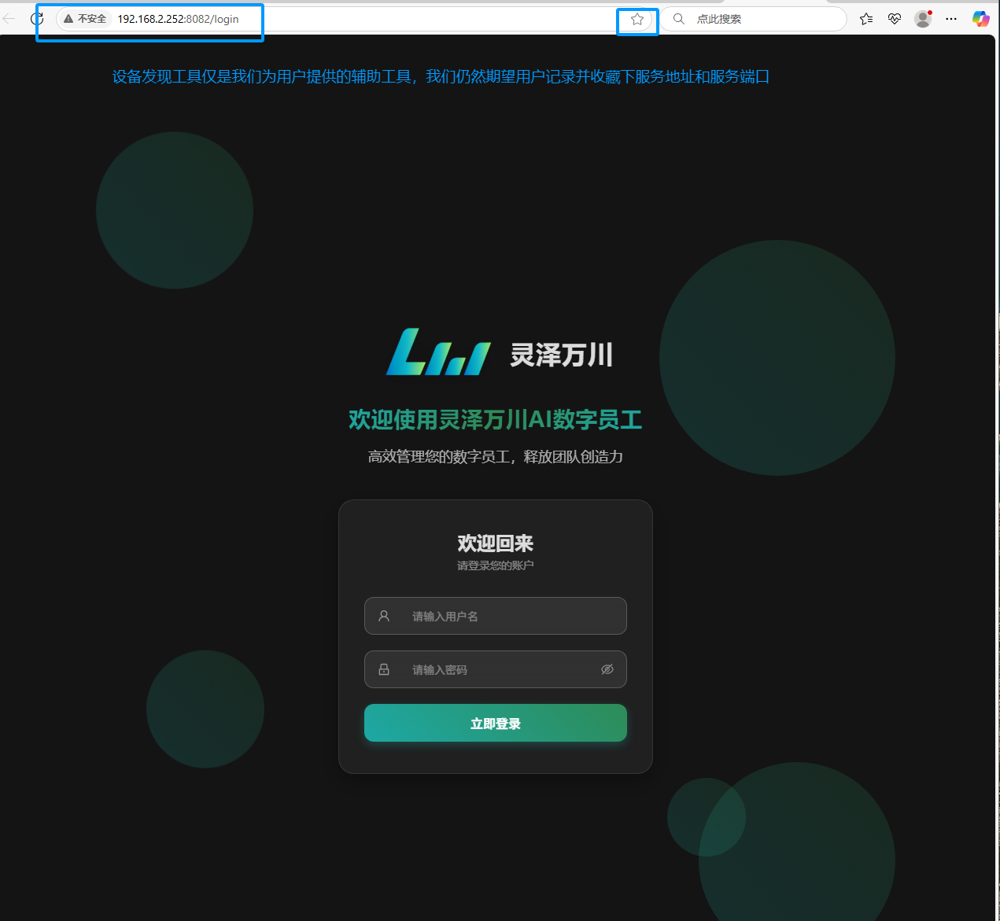

# AgentBox Device Discovery Tool
## 轻松发现和访问局域网内的 AgentBox 设备。

## 📦 工具简介
AgentBox_Device_Discovery Tool 是由 lzwcai 开发的一款局域网设备发现工具。
它能自动扫描网络内的 AgentBox 设备并提供直观的服务访问界面。

## 🚀 使用方法
### 第一步：启动设备发现工具
工具启动后会自动扫描局域网内的设备，并显示设备 IP 和版本信息。
点击设备以选择你要访问的目标设备。

### 第二步：选择访问的服务
点击设备后，系统将弹出服务选择窗口。你可以选择你希望访问的具体服务

选择后，系统将自动打开浏览器跳转至对应服务。

第三步：登录服务界面
浏览器会跳转到所选服务的登录页面。
请输入你的用户名和密码进行登录。

### 🧠 小提示
此设备发现工具仅为辅助工具，强烈建议用户记录并收藏常用服务的地址和端口。

### 📫 联系方式
如有建议或问题，请联系作者 lzwcai。

